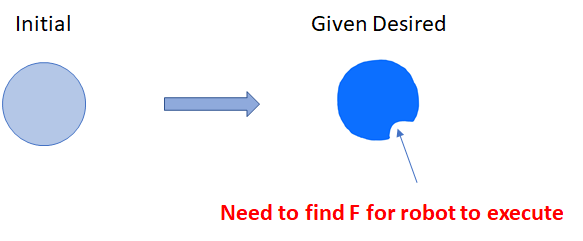

## Project Overview

The goal of our project was to have a multifingered robotic hand be able to reshape a soft object into a desired shape. This functionality could be utilized in industries where soft and malleable objects need to be reshaped consistently or in places where the object needing to be reshaped could consist of potentially harmful chemicals or materials and a human could potentially be exposed to danger or harm. Replacing the human with a robotic arm capable of performing the same task would decrease the risk of a person getting harmed while also increasing the consistency of the reshaping. Some examples of industries in which this could be utilized include the food processing industry, biomedical processing, and robotized surgery. Our full report can be found here <embed src="https://tiffanyec.github.io/206bFinalProjectWebsite/pdf/finalProjectReport.pdf" type="application/pdf" />

## Implementation

Note: Because our code belongs to the Mechanical Systems Control Lab, we were told that we cannot post it online and cannot provide a link to our github.

We formulated our problem as having a soft object (in our case a ball of dough) in an initial shape and having some desired end shape that we want the robot to mold the object into. To do this, our main problem for the project was for the robot to find the amount of force it needs to apply in order to achieve the goal shape.

For our project, we used a 4 DOF BarrettHand BH8-282 implented with ROS, a 6 DOF Robot Arm (FANUC LRMate 200iD/7L) implemented with MATLAB, and 2 cameras (Ensenso N35) implented with MATLAB. 

We broke up our project into two stages: the teaching stage and the testing stage. In the teaching stage, the soft object begins in some initial shape and the robot applies some force F on it to reshape it. A point cloud of the objects new shape is then obtained to observe what applying the force did to reshape the object. In the testing tage, the robot is given a desired shape that we wish the soft object to become. It then calculates a non-rigid transformation T using the point clouds obtained in the teaching stage in order to find the force needed it needs to apply in order to reshape the object into the goal shape. 

During our trials, we had two different shapes that we wanted the robot to reshape the dough into.

### Test Shape 1

The first shape only required the robotic hand and the dough and we wanted one of the fingers to apply a force to one point on the dough and create an indentation there.

  

Rigid transformation and non-rigid transformation:

     

### Test Shape 2

The second shape used a flexible plastic mold along with the robot and the dough. The plastic was placed around the dough and the robot's fingers pressed against the mold in order to shape the dough into a square-like shape with smooth sides.

  

## Results

  <iframe width="560" height="315" src="https://www.youtube.com/embed/knuFI5SsM_Y" frameborder="0" allow="accelerometer; autoplay; encrypted-media; gyroscope; picture-in-picture" allowfullscreen></iframe>

### Test Shape 1: Desired and Actual

  

### Test Shape 2: Desired and Actual

  

## Conclusion
Overall, we were successfully able to have our robot reshape a soft dough into a desired shape with minimal errors. Our first test shape is not completely accurate because of two indentations that occur opposite of the desired indentation. This however is unavoidable because two of the robots fingers are needed to stop the object from moving while the the third finger exerts a force on the object to reshape it and the objects being soft causes the two supporting fingers to also leave imprints. We also assume the initial state of our object for the rigid body transformations and in a real world setting the initial shape of the soft object may not be guaranteed and this would not be practical. We also do not take the material that the object is made of into account. We used a dough in our experiments that is very soft and easy to reshape but other objects, such as modeling clay, can also be reshaped but is much firmer and would require much more force to be reshaped. 

## Team Bios

### Xinghao Zhu 
Xinghao is a 1st year Ph.D. student in ME. He works with Prof. Masayoshi Tomizuka in Mechanical Systems Control (MSC) Labortorary. 
His research interest lies in interdisciplinary combination of Robotics, Artificial Intelligence and Control theories, with the fields in robotic dexterity research and human robot interaction.

### Guangzhao Yang 
Guangzhao is a 5th year EECS M.S. student concentrated in Control, Intelligent Systems and Robotics, and currently works in Professor Ronald S. Fearing's Biomimetic Millisystems Laboratory on legged millirobots cooperation.

### Ting Xu 
Ting is a 1st year M.S student in ME with a concentration in Control. She is currently in the robotics team under Prof. Tomizuka's Mechanical Systems Control labtoratory.

### Tiffany Cappellari
Tiffany is a current 3rd year undergradtuate student at the University of California, Berkeley studying Electrical Engineering and Computer Science. She currently works in Prof. Ronald Fearing's Biomimetic Millisystems Lab.

